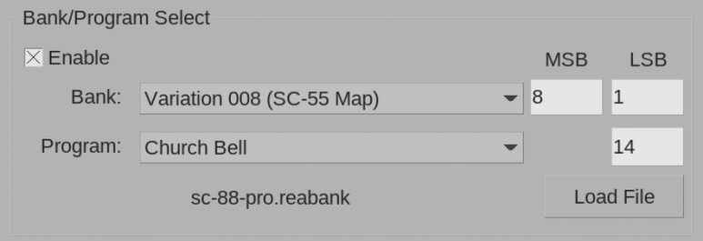

# SC-88 Pro ReaBank
This repo contains a
[reabank](https://stash.reaper.fm/7453/Art_of_Reabanks.pdf) file for
the
[Roland SoundCanvas SC-88 Pro](https://dtm.noyu.me/wiki/Roland_SC-88_Pro)
for use with [Cockos REAPER](https://www.reaper.fm/).

If you are unfamiliar, reabanks contain program and bank information
for selecting instruments on your VSTs or MIDI synths. While you can
select instruments on your synth by manually inputting numbers into
the ReaControlMIDI plugin or the MIDI event editor, loading a reabank
file makes it easier by populating the bank and program dropdowns,
allowing you to simply select the name of your desired instrument.

## Usage

To download, visit the
[release page](https://github.com/SpeedyVelcro/sc-88-pro-reabank/releases/latest)
and download the file "sc-88-pro.reabank". Place the file in a
directory of your choice.

Then, to use it with the ReaControlMIDI plugin:
- Click the FX button on any track
- Use the "Add FX" dialogue to add ReaControlMIDI to your track
- Click the checkbox to enable the Bank/Program Select section
- Click "Load File"
- Browse to where you placed the "sc-88-pro.reabank" file and open it
- Select a bank from the dropdown
- Select a program from the dropdown

Or, to use it with the MIDI event editor
- Open the MIDI editor for a MIDI item
- Select "Bank/Program Select" in the dropdown in the bottom left of
  the screen
- Your MIDI Event lane will no display Bank/Program Select events
- Double click on the MIDI Event lane at the spot where you want to
  insert an instrument change
- Click "Load File"
- Browse to where you placed the "sc-88-pro.reabank" file and open it
- Select a bank from the dropdown
- Select a program from the dropdown
- Click OK

If you are unfamiliar with the terminology used in the bank names, I
would recommend consulting the SC-88 Pro Owner's Manual. But the short
version is that "Capital Instruments" are the basic 128 "General MIDI"
instruments, and the "Variation" banks contain the supported
instruments from the extended "GS" standard.

Maps such as the "SC-88 Map" and "SC-55 Map" send the Bank LSB to
override the setting of the map buttons on the front of your device.

The "Drum Sets" bank contains all the instruments for your drum
channel. Typically this is used only on channel 10 if you're using the
default out-of-the-box settings on your SoundCanvas.

## License
This repo is licensed under the CC0 1.0 license (basically publice
domain), which you can read in the `LICENSE` file
[here](./LICENSE).

## Contributing
Please report any mistakes or errors you find in the issues section.
Feel free to open PRs too, and I'll take a look at them.

## Roadmap
While this reabank contains all the instruments and variations for the
default, SC-88 and SC-55 maps, there are still a few more slightly more
obscure banks to be added, as well as a couple changes I want to make:
- CM-64 map
- Native map (the default map of LSB 0 uses native sounds by default,
  but LSB 3 allows you to override the map buttons on the front of the
  device)
- User instruments
- Adding "(legato)" to the names of applicable instruments (this is
  important because sometimes the legato feature is the only thing
  distinguishing identically-named instruments)

